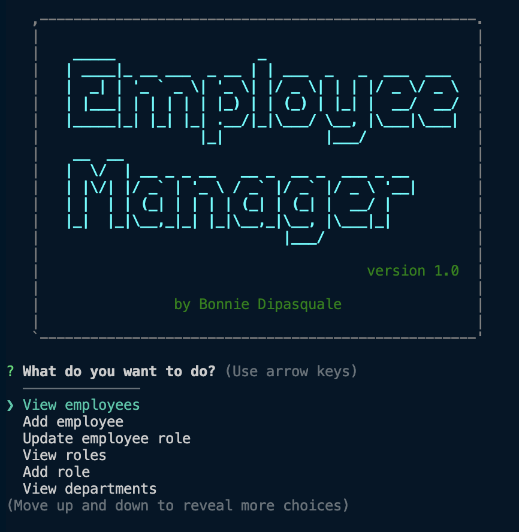

# CLI-CMS
### a simple cms for the command line
<br><br>

## Table of Contents
  - [Usage](#usage)
  - [Screenshot](#screenshot)
  - [Credits](#credits)
  - [License](#license)
  - [Tests](#tests)

<br><br>

# Usage
```
git clone git@github.com:bvasko/CLI-CMS.git
npm install
```

Run the database migrations in schema.sql and seeds.sql

To run the program:
``` node server.js ```

<br><br>
# Demo Video
[Watch Demo Video](./demo.mp4)

<br><br>
# Screenshot

<br><br>
# Contribute
Contributions are welcome!
Fork the repo, make your changes and submit a PR

<br><br>
# Credits
Author: [bvasko](https://github.com/bvasko)

<br><br>


# Reference Material

### Create seperation of concerns so database can be mocked for TDD
- [Dependency Injection in JavaScript](https://sammeechward.com/dependency-injection-in-javascript/)
- [Mocking a Database in Node with Jest](https://sammeechward.com/mocking-a-database-with-jest-in-javascript/)

<br><br>
# License
[MIT](https://choosealicense.com/licenses/mit/)  

<br><br>
# Tests
npm test

<br><br>
## Questions?
View my github profile: [bvasko](https://github.com/bvasko)
or email me at [bvasko@gmail.com](bvasko@gmail.com)
    